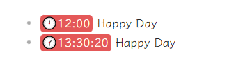

# Hightlight In Preview

This is a plugin that enhanced regex preview in Obsidian,like dynamic highlights did but in Preview mode.

By default, the plugin will use the same regex as the dynamic highlights plugin, but you can customize it in the settings(NOT YET).



## Features

- Default Feature: Support Timestamp Highlight, like HH:mm or HH:mm:ss. It will add classes to the timestamp text, so you can customize the style in your css file.
- REGEX Feature: You need to install dynamic highlights plugin first, and then you can use the regex in the settings to highlight the text you want.


## Usage

1. Install the plugin
2. Enable the plugin in the settings
3. Add css style in your css file, like this:

<details>
```css
/* @settings
name: Time Color
id: time
settings:
    - 
        title: Time Color
        description: Change the color of the time mark
        id: time-color		
        type: variable-themed-color
        format: hex
        default-dark: '#E45858'
        default-light: '#E45858'
    - 
        title: Time Font Color
        description: Change the  color of the time font mark
        id: time-font-color		
        type: variable-themed-color
        format: hex
        default-dark: '#FFFBF0'
        default-light: '#FFFBF0'

*/

.theme-light, .theme-dark {
--time-color: #E45858;
/* --time-dark-color: #2b9183; */
--time-font-color: #FFFBF0;
}

.time {
color: var(--time-font-color) ; /*象牙白*/
background-color: var(--time-color); /* 铜绿 #40bfaf;*/
font-style:normal;
padding-top: 0px;
padding-bottom: 2px;
padding-right: 4px;
padding-left: 1px;
border-radius: 5px;
}

.time::before {
content: "🕒";
background-color: "";
}

.theme-light .light-time-1 {
color: var(--time-font-color) ; /*象牙白*/
background-color: var(--time-color); /* 铜绿 #40bfaf;*/
font-style:normal;
padding-top: 0px;
padding-bottom: 2px;
padding-right: 4px;
padding-left: 1px;
border-radius: 5px;
}

.theme-light .light-time-1::before {
content: "🕐";
background-color: "";
}

.theme-light .light-time-1-5 {
color: var(--time-font-color) ; /*象牙白*/
background-color: var(--time-color); /* 铜绿 #40bfaf;*/
font-style:normal;
padding-top: 0px;
padding-bottom: 2px;
padding-right: 4px;
padding-left: 1px;
border-radius: 5px;
}

.theme-light .light-time-1-5::before {
content: "🕜";
background-color: "";
}

.theme-light .light-time-2 {
color: var(--time-font-color) ; /*象牙白*/
background-color: var(--time-color); /* 铜绿 #40bfaf;*/
font-style:normal;
padding-top: 0px;
padding-bottom: 2px;
padding-right: 4px;
padding-left: 1px;
border-radius: 5px;
}

.theme-light .light-time-2::before {
content: "🕑";
background-color: "";
}

.theme-light .light-time-2-5 {
color: var(--time-font-color) ; /*象牙白*/
background-color: var(--time-color); /* 铜绿 #40bfaf;*/
font-style:normal;
padding-top: 0px;
padding-bottom: 2px;
padding-right: 4px;
padding-left: 1px;
border-radius: 5px;
}

.theme-light .light-time-2-5::before {
content: "🕝";
background-color: "";
}

.theme-light .light-time-3 {
color: var(--time-font-color) ; /*象牙白*/
background-color: var(--time-color); /* 铜绿 #40bfaf;*/
font-style:normal;
padding-top: 0px;
padding-bottom: 2px;
padding-right: 4px;
padding-left: 1px;
border-radius: 5px;
}

.theme-light .light-time-3::before {
content: "🕒";
background-color: "";
}


.theme-light .light-time-3-5 {
color: var(--time-font-color) ; /*象牙白*/
background-color: var(--time-color); /* 铜绿 #40bfaf;*/
font-style:normal;
padding-top: 0px;
padding-bottom: 2px;
padding-right: 4px;
padding-left: 1px;
border-radius: 5px;
}

.theme-light .light-time-3-5::before {
content: "🕞";
background-color: "";
}

.theme-light .light-time-4 {
color: var(--time-font-color) ; /*象牙白*/
background-color: var(--time-color); /* 铜绿 #40bfaf;*/
font-style:normal;
padding-top: 0px;
padding-bottom: 2px;
padding-right: 4px;
padding-left: 1px;
border-radius: 5px;
}

.theme-light .light-time-4::before {
content: "🕓";
background-color: "";
}

.theme-light .light-time-4-5 {
color: var(--time-font-color) ; /*象牙白*/
background-color: var(--time-color); /* 铜绿 #40bfaf;*/
font-style:normal;
padding-top: 0px;
padding-bottom: 2px;
padding-right: 4px;
padding-left: 1px;
border-radius: 5px;
}

.theme-light .light-time-4-5::before {
content: "🕟";
background-color: "";
}

.theme-light .light-time-5 {
color: var(--time-font-color) ; /*象牙白*/
background-color: var(--time-color); /* 铜绿 #40bfaf;*/
font-style:normal;
padding-top: 0px;
padding-bottom: 2px;
padding-right: 4px;
padding-left: 1px;
border-radius: 5px;
}

.theme-light .light-time-5::before {
content: "🕔";
background-color: "";
}

.theme-light .light-time-5-5 {
color: var(--time-font-color) ; /*象牙白*/
background-color: var(--time-color); /* 铜绿 #40bfaf;*/
font-style:normal;
padding-top: 0px;
padding-bottom: 2px;
padding-right: 4px;
padding-left: 1px;
border-radius: 5px;
}

.theme-light .light-time-5-5::before {
content: "🕠";
background-color: "";
}

.theme-light .light-time-6 {
color: var(--time-font-color) ; /*象牙白*/
background-color: var(--time-color); /* 铜绿 #40bfaf;*/
font-style:normal;
padding-top: 0px;
padding-bottom: 2px;
padding-right: 4px;
padding-left: 1px;
border-radius: 5px;
}

.theme-light .light-time-6::before {
content: "🕕";
background-color: "";
}

.theme-light .light-time-6-5 {
color: var(--time-font-color) ; /*象牙白*/
background-color: var(--time-color); /* 铜绿 #40bfaf;*/
font-style:normal;
padding-top: 0px;
padding-bottom: 2px;
padding-right: 4px;
padding-left: 1px;
border-radius: 5px;
}

.theme-light .light-time-6-5::before {
content: "🕡";
background-color: "";
}

.theme-light .light-time-7 {
color: var(--time-font-color) ; /*象牙白*/
background-color: var(--time-color); /* 铜绿 #40bfaf;*/
font-style:normal;
padding-top: 0px;
padding-bottom: 2px;
padding-right: 4px;
padding-left: 1px;
border-radius: 5px;
}

.theme-light .light-time-7::before {
content: "🕖";
background-color: "";
}

.theme-light .light-time-7-5 {
color: var(--time-font-color) ; /*象牙白*/
background-color: var(--time-color); /* 铜绿 #40bfaf;*/
font-style:normal;
padding-top: 0px;
padding-bottom: 2px;
padding-right: 4px;
padding-left: 1px;
border-radius: 5px;
}

.theme-light .light-time-7-5::before {
content: "🕢";
background-color: "";
}

.theme-light .light-time-8 {
color: var(--time-font-color) ; /*象牙白*/
background-color: var(--time-color); /* 铜绿 #40bfaf;*/
font-style:normal;
padding-top: 0px;
padding-bottom: 2px;
padding-right: 4px;
padding-left: 1px;
border-radius: 5px;
}

.theme-light .light-time-8::before {
content: "🕗";
background-color: "";
}

.theme-light .light-time-8-5 {
color: var(--time-font-color) ; /*象牙白*/
background-color: var(--time-color); /* 铜绿 #40bfaf;*/
font-style:normal;
padding-top: 0px;
padding-bottom: 2px;
padding-right: 4px;
padding-left: 1px;
border-radius: 5px;
}

.theme-light .light-time-8-5::before {
content: "🕣";
background-color: "";
}

.theme-light .light-time-9 {
color: var(--time-font-color) ; /*象牙白*/
background-color: var(--time-color); /* 铜绿 #40bfaf;*/
font-style:normal;
padding-top: 0px;
padding-bottom: 2px;
padding-right: 4px;
padding-left: 1px;
border-radius: 5px;
}

.theme-light .light-time-9::before {
content: "🕘";
background-color: "";
}

.theme-light .light-time-9-5 {
color: var(--time-font-color) ; /*象牙白*/
background-color: var(--time-color); /* 铜绿 #40bfaf;*/
font-style:normal;
padding-top: 0px;
padding-bottom: 2px;
padding-right: 4px;
padding-left: 1px;
border-radius: 5px;
}

.theme-light .light-time-9-5::before {
content: "🕤";
background-color: "";
}

.theme-light .light-time-10 {
color: var(--time-font-color) ; /*象牙白*/
background-color: var(--time-color); /* 铜绿 #40bfaf;*/
font-style:normal;
padding-top: 0px;
padding-bottom: 2px;
padding-right: 4px;
padding-left: 1px;
border-radius: 5px;
}

.theme-light .light-time-10::before {
content: "🕙";
background-color: "";
}

.theme-light .light-time-10-5 {
color: var(--time-font-color) ; /*象牙白*/
background-color: var(--time-color); /* 铜绿 #40bfaf;*/
font-style:normal;
padding-top: 0px;
padding-bottom: 2px;
padding-right: 4px;
padding-left: 1px;
border-radius: 5px;
}

.theme-light .light-time-10-5::before {
content: "🕥";
background-color: "";
}

.theme-light .light-time-11 {
color: var(--time-font-color) ; /*象牙白*/
background-color: var(--time-color); /* 铜绿 #40bfaf;*/
font-style:normal;
padding-top: 0px;
padding-bottom: 2px;
padding-right: 4px;
padding-left: 1px;
border-radius: 5px;
}

.theme-light .light-time-11::before {
content: "🕚";
background-color: "";
}

.theme-light .light-time-11-5 {
color: var(--time-font-color) ; /*象牙白*/
background-color: var(--time-color); /* 铜绿 #40bfaf;*/
font-style:normal;
padding-top: 0px;
padding-bottom: 2px;
padding-right: 4px;
padding-left: 1px;
border-radius: 5px;
}

.theme-light .light-time-11-5::before {
content: "🕦";
background-color: "";
}

.theme-light .light-time-12 {
color: var(--time-font-color) ; /*象牙白*/
background-color: var(--time-color); /* 铜绿 #40bfaf;*/
font-style:normal;
padding-top: 0px;
padding-bottom: 2px;
padding-right: 4px;
padding-left: 1px;
border-radius: 5px;
}

.theme-light .light-time-12::before {
content: "🕛";
background-color: "";
}

.theme-light .light-time-12-5 {
color: var(--time-font-color) ; /*象牙白*/
background-color: var(--time-color); /* 铜绿 #40bfaf;*/
font-style:normal;
padding-top: 0px;
padding-bottom: 2px;
padding-right: 4px;
padding-left: 1px;
border-radius: 5px;
}

.theme-light .light-time-12-5::before {
content: "🕧";
background-color: "";
}

.theme-dark .light-time-1 {
color: var(--time-font-color) ; /*象牙白*/
background-color: var(--time-color); /* 铜绿 #40bfaf;*/
font-style:normal;
padding-top: 0px;
padding-bottom: 2px;
padding-right: 4px;
padding-left: 1px;
border-radius: 5px;
}

.theme-dark .light-time-1::before {
content: "🕐";
background-color: "";
}

.theme-dark .light-time-1-5 {
color: var(--time-font-color) ; /*象牙白*/
background-color: var(--time-color); /* 铜绿 #40bfaf;*/
font-style:normal;
padding-top: 0px;
padding-bottom: 2px;
padding-right: 4px;
padding-left: 1px;
border-radius: 5px;
}

.theme-dark .light-time-1-5::before {
content: "🕜";
background-color: "";
}

.theme-dark .light-time-2 {
color: var(--time-font-color) ; /*象牙白*/
background-color: var(--time-color); /* 铜绿 #40bfaf;*/
font-style:normal;
padding-top: 0px;
padding-bottom: 2px;
padding-right: 4px;
padding-left: 1px;
border-radius: 5px;
}

.theme-dark .light-time-2::before {
content: "🕑";
background-color: "";
}

.theme-dark .light-time-2-5 {
color: var(--time-font-color) ; /*象牙白*/
background-color: var(--time-color); /* 铜绿 #40bfaf;*/
font-style:normal;
padding-top: 0px;
padding-bottom: 2px;
padding-right: 4px;
padding-left: 1px;
border-radius: 5px;
}

.theme-dark .light-time-2-5::before {
content: "🕝";
background-color: "";
}

.theme-dark .light-time-3 {
color: var(--time-font-color) ; /*象牙白*/
background-color: var(--time-color); /* 铜绿 #40bfaf;*/
font-style:normal;
padding-top: 0px;
padding-bottom: 2px;
padding-right: 4px;
padding-left: 1px;
border-radius: 5px;
}

.theme-dark .light-time-3::before {
content: "🕒";
background-color: "";
}


.theme-dark .light-time-3-5 {
color: var(--time-font-color) ; /*象牙白*/
background-color: var(--time-color); /* 铜绿 #40bfaf;*/
font-style:normal;
padding-top: 0px;
padding-bottom: 2px;
padding-right: 4px;
padding-left: 1px;
border-radius: 5px;
}

.theme-dark .light-time-3-5::before {
content: "🕞";
background-color: "";
}

.theme-dark .light-time-4 {
color: var(--time-font-color) ; /*象牙白*/
background-color: var(--time-color); /* 铜绿 #40bfaf;*/
font-style:normal;
padding-top: 0px;
padding-bottom: 2px;
padding-right: 4px;
padding-left: 1px;
border-radius: 5px;
}

.theme-dark .light-time-4::before {
content: "🕓";
background-color: "";
}

.theme-dark .light-time-4-5 {
color: var(--time-font-color) ; /*象牙白*/
background-color: var(--time-color); /* 铜绿 #40bfaf;*/
font-style:normal;
padding-top: 0px;
padding-bottom: 2px;
padding-right: 4px;
padding-left: 1px;
border-radius: 5px;
}

.theme-dark .light-time-4-5::before {
content: "🕟";
background-color: "";
}

.theme-dark .light-time-5 {
color: var(--time-font-color) ; /*象牙白*/
background-color: var(--time-color); /* 铜绿 #40bfaf;*/
font-style:normal;
padding-top: 0px;
padding-bottom: 2px;
padding-right: 4px;
padding-left: 1px;
border-radius: 5px;
}

.theme-dark .light-time-5::before {
content: "🕔";
background-color: "";
}

.theme-dark .light-time-5-5 {
color: var(--time-font-color) ; /*象牙白*/
background-color: var(--time-color); /* 铜绿 #40bfaf;*/
font-style:normal;
padding-top: 0px;
padding-bottom: 2px;
padding-right: 4px;
padding-left: 1px;
border-radius: 5px;
}

.theme-dark .light-time-5-5::before {
content: "🕠";
background-color: "";
}

.theme-dark .light-time-6 {
color: var(--time-font-color) ; /*象牙白*/
background-color: var(--time-color); /* 铜绿 #40bfaf;*/
font-style:normal;
padding-top: 0px;
padding-bottom: 2px;
padding-right: 4px;
padding-left: 1px;
border-radius: 5px;
}

.theme-dark .light-time-6::before {
content: "🕕";
background-color: "";
}

.theme-dark .light-time-6-5 {
color: var(--time-font-color) ; /*象牙白*/
background-color: var(--time-color); /* 铜绿 #40bfaf;*/
font-style:normal;
padding-top: 0px;
padding-bottom: 2px;
padding-right: 4px;
padding-left: 1px;
border-radius: 5px;
}

.theme-dark .light-time-6-5::before {
content: "🕡";
background-color: "";
}

.theme-dark .light-time-7 {
color: var(--time-font-color) ; /*象牙白*/
background-color: var(--time-color); /* 铜绿 #40bfaf;*/
font-style:normal;
padding-top: 0px;
padding-bottom: 2px;
padding-right: 4px;
padding-left: 1px;
border-radius: 5px;
}

.theme-dark .light-time-7::before {
content: "🕖";
background-color: "";
}

.theme-dark .light-time-7-5 {
color: var(--time-font-color) ; /*象牙白*/
background-color: var(--time-color); /* 铜绿 #40bfaf;*/
font-style:normal;
padding-top: 0px;
padding-bottom: 2px;
padding-right: 4px;
padding-left: 1px;
border-radius: 5px;
}

.theme-dark .light-time-7-5::before {
content: "🕢";
background-color: "";
}

.theme-dark .light-time-8 {
color: var(--time-font-color) ; /*象牙白*/
background-color: var(--time-color); /* 铜绿 #40bfaf;*/
font-style:normal;
padding-top: 0px;
padding-bottom: 2px;
padding-right: 4px;
padding-left: 1px;
border-radius: 5px;
}

.theme-dark .light-time-8::before {
content: "🕗";
background-color: "";
}

.theme-dark .light-time-8-5 {
color: var(--time-font-color) ; /*象牙白*/
background-color: var(--time-color); /* 铜绿 #40bfaf;*/
font-style:normal;
padding-top: 0px;
padding-bottom: 2px;
padding-right: 4px;
padding-left: 1px;
border-radius: 5px;
}

.theme-dark .light-time-8-5::before {
content: "🕣";
background-color: "";
}

.theme-dark .light-time-9 {
color: var(--time-font-color) ; /*象牙白*/
background-color: var(--time-color); /* 铜绿 #40bfaf;*/
font-style:normal;
padding-top: 0px;
padding-bottom: 2px;
padding-right: 4px;
padding-left: 1px;
border-radius: 5px;
}

.theme-dark .light-time-9::before {
content: "🕘";
background-color: "";
}

.theme-dark .light-time-9-5 {
color: var(--time-font-color) ; /*象牙白*/
background-color: var(--time-color); /* 铜绿 #40bfaf;*/
font-style:normal;
padding-top: 0px;
padding-bottom: 2px;
padding-right: 4px;
padding-left: 1px;
border-radius: 5px;
}

.theme-dark .light-time-9-5::before {
content: "🕤";
background-color: "";
}

.theme-dark .light-time-10 {
color: var(--time-font-color) ; /*象牙白*/
background-color: var(--time-color); /* 铜绿 #40bfaf;*/
font-style:normal;
padding-top: 0px;
padding-bottom: 2px;
padding-right: 4px;
padding-left: 1px;
border-radius: 5px;
}

.theme-dark .light-time-10::before {
content: "🕙";
background-color: "";
}

.theme-dark .light-time-10-5 {
color: var(--time-font-color) ; /*象牙白*/
background-color: var(--time-color); /* 铜绿 #40bfaf;*/
font-style:normal;
padding-top: 0px;
padding-bottom: 2px;
padding-right: 4px;
padding-left: 1px;
border-radius: 5px;
}

.theme-dark .light-time-10-5::before {
content: "🕥";
background-color: "";
}

.theme-dark .light-time-11 {
color: var(--time-font-color) ; /*象牙白*/
background-color: var(--time-color); /* 铜绿 #40bfaf;*/
font-style:normal;
padding-top: 0px;
padding-bottom: 2px;
padding-right: 4px;
padding-left: 1px;
border-radius: 5px;
}

.theme-dark .light-time-11::before {
content: "🕚";
background-color: "";
}

.theme-dark .light-time-11-5 {
color: var(--time-font-color) ; /*象牙白*/
background-color: var(--time-color); /* 铜绿 #40bfaf;*/
font-style:normal;
padding-top: 0px;
padding-bottom: 2px;
padding-right: 4px;
padding-left: 1px;
border-radius: 5px;
}

.theme-dark .light-time-11-5::before {
content: "🕦";
background-color: "";
}

.theme-dark .light-time-12 {
color: var(--time-font-color) ; /*象牙白*/
background-color: var(--time-color); /* 铜绿 #40bfaf;*/
font-style:normal;
padding-top: 0px;
padding-bottom: 2px;
padding-right: 4px;
padding-left: 1px;
border-radius: 5px;
}

.theme-dark .light-time-12::before {
content: "🕛";
background-color: "";
}

.theme-dark .light-time-12-5 {
color: var(--time-font-color) ; /*象牙白*/
background-color: var(--time-color); /* 铜绿 #40bfaf;*/
font-style:normal;
padding-top: 0px;
padding-bottom: 2px;
padding-right: 4px;
padding-left: 1px;
border-radius: 5px;
}

.theme-dark .light-time-12-5::before {
content: "🕧";
background-color: "";
}
```
</details>

## Installation

- Not ready for market yet
- Can be installed via the [Brat](https://github.com/TfTHacker/obsidian42-brat) plugin
- Manual installation

1. Find the release page on this github page and click
2. Download the latest release zip file
3. Unzip it, copy the unzipped folder to the obsidian plugin folder, make sure there are main.js and manifest.json files
   in the folder
4. Restart obsidian (do not restart also, you have to refresh plugin list), in the settings interface to enable the
   plugin
5. Done!

## Support

If you are enjoying this plugin then please support my work and enthusiasm by buying me a coffee
on [https://www.buymeacoffee.com/boninall](https://www.buymeacoffee.com/boninall).
.

<a href="https://www.buymeacoffee.com/boninall"></a>
